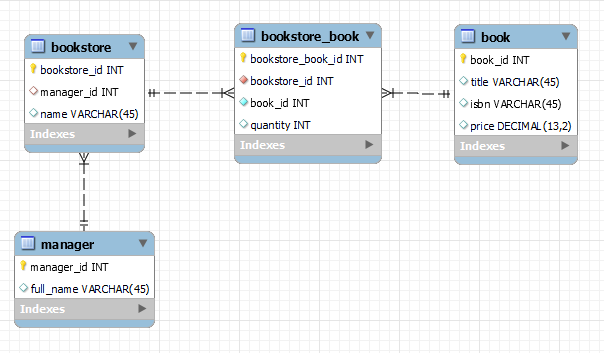

# Java Spring Boot Data Access
Helper project used to access a MySQL database.  Latest assignments are on the dev branch [here](assignments.md).

# Getting Started
- Create new local directory
- Clone this repo in that directory: `git clone git@github.com:mburolla/siu-java-spring-boot-da-1.git`
- Create `src/main/resources/application.properties` file 
- Copy and pastes contents from `application.properties.template` file to `application.properties` file
- Update DB credentials fields in `application.properties` file
- Run the project
- Use ReST client (e.g. Postman) to test an endpoint

# Workflow
- One time only: Add yourself as a Watcher to the repo (top right dropdown)
- Branch from `dev` branch using the following naming schema:
  - `dev-{your two letter initials}-{excerise number}`
  - Example: `git checkout -b dev-mb-ex1`
- Write code on this branch
- Before you commit, check the status of files that have been changed: `git status`
- Stage your files: `git add --all`
- Add a commit message: `git commit -m "Finish ex1"`
- Push your branch: `git push origin dev-mb-ex1`
- Create PR in GitHub:
  - Create title: `Finish Ex1`
  - Optionally add a description
  - *** SCROLL DOWN AND REVIEW YOUR CHANGES ***
  - Click green button: [Create Pull Request]
  - Wait for Instructor to review
  - Watch your email for notifications  
  - If changes are necessary, make those changes, stage, commit and push the branch again
  - Once your PR has been merged, sync-up your code on your laptop for the remote `dev` branch:
    - Switch branch: `git checkout dev`
    - Get code: `git pull origin dev`
  - Delete your local branch: `git branch -d dev-mb-ex1`
  - Repeat

# Endpoints

|Action|Message|
|------|-------|
|GET   |http://localhost:8080/instructor/api/v1/message|
|GET   |http://localhost:8080/student{id}/api/v1/message|

# Common Git Commands
```
git init
git clone <url>
git fetch --all
git push origin <branch name>
git pull origin <branch name>
git remote add origin <url>
git add --all
git branch -a
git checkout -b <new branch name>
git checkout
git commit -m "your message"
git status
git reset --hard
git clean --f
git stash
```

# Database Schema 
#### Version: 0.0.1


